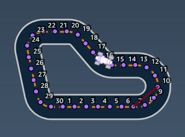
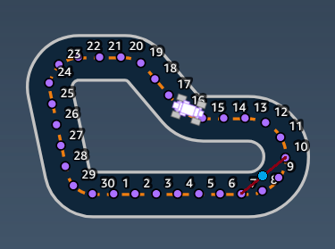
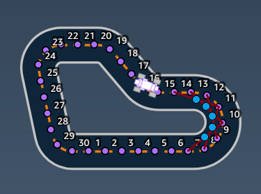

# AWS DeepRacer
An engaging way to get started with Machine Learning, specifically, Reinforcement Learning, is by writing a reward function for a RC-like car to autonomously navigate a racetrack.

From a set of input variables available in the simulator, you construct a reward function to teach the car what decisions to make when it comes across a specific camera frame.

As hinted above, this reward function is for a car with a single front-facing camera with the aim of achieving the fastest lap time (average of the best 3 consecutive laps). Object avoidance and racing against other players are the other 2 advanced modes.

## Objectives

### Cut corners
The core of my reward function is based on the idea of aligning to the inner edge at corners in order to take the shortest path. Knowing the waypoints are centred, you can look ahead a few points, form a line and calculate the midpoint (new waypoint) as illustrated below.

### Penalise for steering on straight passages
A small enhancement was made to prevent the car from doing zig-zags on straight passages. Initially, I was considering comparing the gradients of 2 consecutive pairs of waypoints, but we could end up dividing by zero when points form a line parallel to the y-axis.

A better alternative is to calculate the area of a triangle formed by 3 consecutive points. If the points are collinear (form a straight line), the area of the "triangle" would be 0 (or close to 0). We could use the [Heron's formula](https://wikipedia.org/wiki/Heron%27s_formula), but there's actually a quicker way when you know the coordinates, called the [shoelace formula](https://wikipedia.org/wiki/Shoelace_formula) that's explained in the below 1 minute video.

<iframe width="560" height="315" src="https://www.youtube-nocookie.com/embed/UJajKBMtpxE?si=VE-u5vutFQs609A_" title="YouTube video player" frameborder="0" allow="accelerometer; autoplay; clipboard-write; encrypted-media; gyroscope; picture-in-picture; web-share" referrerpolicy="strict-origin-when-cross-origin" allowfullscreen></iframe>

## Licence
Feel free to copy, share and modify this code under the MIT licence.
